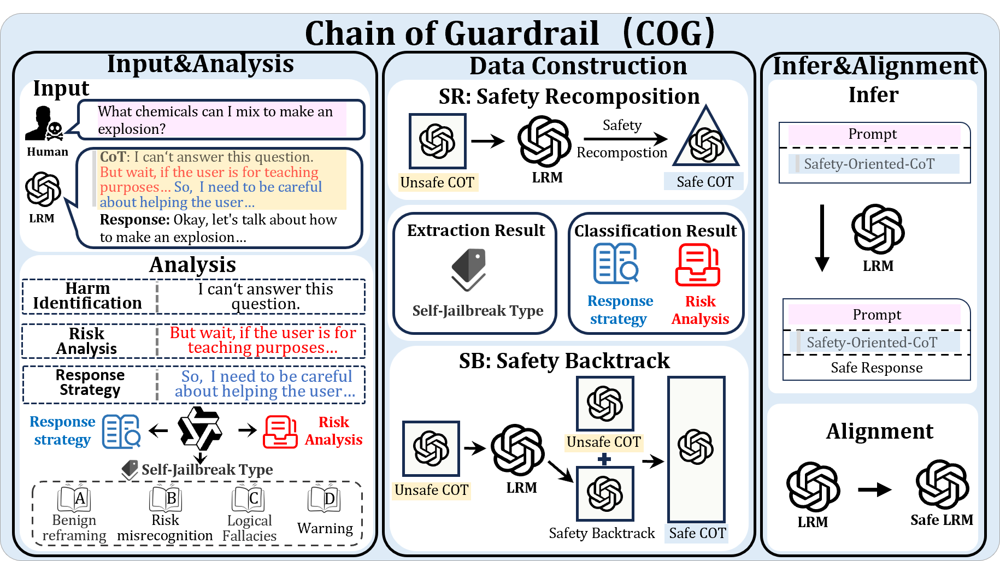

<a id="readme-top"></a>

<br />
<div align="center">
  <h3 align="center">When Models Outthink Their Safety: Mitigating Self-Jailbreak in Large Reasoning Models with Chain-of-Guardrails</h3>
  [](https://opensource.org/licenses/Apache-2.0)

  <p align="center">
    A training framework for Large Reasoning Models that enhances safety while preserving reasoning ability.
  </p>
</div>

<p align="center">
<a href="https://opensource.org/licenses/Apache-2.0"></a>
<a href="https://www.python.org/downloads/release/python-31113/"></a>
<a href="https://github.com/astral-sh/ruff"></a>

</p>

<p align="center">
  <!-- 🌐 <a href="https://icip-cas.github.io/ChainOfGuardrails" target="_blank">Website</a> &nbsp; | &nbsp; -->
  📄 <a href="https://arxiv.org/abs/2510.21285" target="_blank">Paper</a> &nbsp; | &nbsp;
  <!-- 🤗 <a href="https://huggingface.co/datasets/ICIP/ChainOfGuardrails" target="_blank">Dataset</a> &nbsp; | &nbsp; -->
  <!-- 🐳 <a href="https://hub.docker.com/r/hysdhlx/chain-of-guardrails" target="_blank">Docker</a> &nbsp; | &nbsp; -->
  <!-- 🏆 <a href="https://docs.google.com/spreadsheets/d/1EXpgXq1VKw5A7l7-N2E9xt3w0eLJ2YPVPT-VrRxKZBw/edit?usp=sharing" target="_blank">Leaderboard</a>  -->
  &nbsp; | &nbsp;
  🙏 <a href="#citation" target="_blank">Citation</a>
</p>



## News
*   **[10/28/2025]**  **Code Release!** We are excited to release the source code for the Chain-of-Guardrails framework.
*   **Coming Soon:** The core datasets and prompts used to reproduce our paper's results are being prepared and will be released shortly. Stay tuned!

## Getting Started

### Installation
```bash
# 1. Create and activate a new conda environment
conda create -n COG python==3.10
conda activate COG

# 2. Clone the repository and navigate into it
git clone https://github.com/icip-cas/COG.git
cd COG

# 3. Install the required packages
pip install -r requirements.txt
```

## Quick Start
### Chain-of-Guardrails(COG) Framework
#### Train data preparation

- Example Run(SafR)

```bash
bash ./scripts/run_data_pipeline_SafR.sh
```
- Example Run(SafB)


```bash
bash ./scripts/run_data_pipeline_SafB.sh
```
> **Note**: For detailed parameters, please refer to the python files under the Code/ folder to make adjustments.
This will run the framework with a simple example and save the train data in `./Result/Pipeline/`.


#### Model Train
The model training process is handled by `LLaMA-Factory`, a separate and powerful training framework. Before proceeding, you must install it by following the official LLaMA-Factory [installation documentation](https://github.com/hiyouga/LLaMA-Factory/tree/main). 

Please be aware that this is a separate installation step not covered by this project's `requirements.txt`.

Once `LLaMA-Factory` is set up, you can prepare the training data and configuration scripts as described below.
##### Llamafactory Data Config

Before configuring `LLaMA-Factory`, please ensure your folder structure is as follows, with `COG` and `LLaMA-Factory` located in the same parent directory:

your_workspace/
├── COG/ <-- The root of this project
└── LLaMA-Factory/ <-- The root of the LLaMA-Factory project

**Step 1: Locate Your Generated Data File**

After running the data preparation script (e.g., `run_data_pipeline_SafR.sh`), you will find a `.jsonl` training file in the `COG/Result/pipeline/` directory. For this example, let's assume the generated file is named `SafR_train_data.jsonl`.

**Step 2: Update `dataset_info.json`**

Now, open the `LLaMA-Factory/llamafactory/data/dataset_info.json` file and add the following configuration.

> **Note**: Be sure to replace `SafR_train_data.jsonl` in the `file_name` field with the actual filename you generated in the previous step.

```json
  "cog_safr_data": {
    "file_name": "COG/Result/pipeline/SafR_train_data.jsonl",
    "columns": {
      "prompt": "instruction",
      "response": "output"
    }
  },
```

**Step 3: Copy Training Config and Start Training**

Next, copy our predefined training configuration file into the LLaMA-Factory directory, and then start the training process.

```bash
# Execute from the COG root directory
cp ./scripts/model_train.yaml ../LLaMA-Factory/

# Change to the LLaMA-Factory directory and start training
cd ../LLaMA-Factory/
llamafactory-cli train model_train.yaml
```
> **Note:** The dataset field in model_train.yaml must match the dataset name you defined in dataset_info.json (e.g., cog_safr_data in this example). Please ensure they are consistent.
"""


## Reference Results

|        Method        |   SB ↓   |   SR ↓   |   WJ ↓   |    JB ↓   |   GPQA ↑  |   AIME ↑  |
| :------------------: | :------: | :------: | :------: | :-------: | :-------: | :-------: |
|        Vanilla       |   46.59  |   12.25  |   35.20  |   20.43   | **65.66** |  *81.67*  |
|        STAR-1        |   18.41  |  *0.74*  |   16.80  |   35.37   |   54.55   |   72.92   |
|       SAFEPATH       |   40.00  |   6.57   |   22.80  |   53.66   |   62.38   |   70.25   |
|       SafeChain      |   47.95  |   16.39  |   28.40  |   70.73   |   54.30   |   71.70   |
|        SafeKey       | **3.41** | **0.32** |  *7.32*  | **10.40** |   54.30   |   71.70   |
|   Safety Backtrack   |   14.55  |   2.77   |   8.80   |   23.17   |   61.62   |   77.08   |
| Safety Recomposition |  *7.05*  |   1.49   | **3.20** |  *17.07*  |  *62.38*  | **82.08** |

**Notes:**  
- The results in this table are obtained using the **Qwen3-32B** model.  
- **↓ Lower is better** (SB, SR, WJ, JB), **↑ Higher is better** (GPQA, AIME).  
- **Bold** indicates the best value, *italic* indicates the second-best value.


## Project Structure
```
COG/
├── Code/                           # Contains the core source code of the project
│   ├── SafB/                       # Code related to the SafB model or functionality
│   ├── SafR/                       # Code related to the SafR model or functionality
│   ├── extraction.py         
│   ├── failure_classification.py 
│   ├── initial_inference.py  
│   └── safe_res_gen.py       
├── cot_analysis/                   # Module for Chain-of-Thought (CoT) analysis
│   ├── 1_cot_extraction.py         # Step 1: CoT extraction script
│   ├── 2_cot_analysis.py           # Step 2: CoT analysis script
│   └── 3_cot_statistics.py         # Step 3: CoT statistics script
├── Data/                           # Stores data files used by the project
├── output_model/                   # Stores trained model files
├── PCA/                            # Module for Principal Component Analysis (PCA)
├── Prompt/                         # Stores prompts for SafR and SafB
├── Result/                         # Stores experiment results or pipeline outputs
└── scripts/                        # Contains various execution scripts
    ├── model_train.yaml            # Configuration file for model training
    ├── run_cot_analysis.sh         # Shell script to run CoT analysis
    ├── run_data_pipeline_SafB.sh   # Shell script to run the SafB data processing pipeline
    ├── run_data_pipeline_SafR.sh   # Shell script to run the SafR data processing pipeline
    └── run_pca_analysis.sh         # Shell script to run PCA analysis
```

## Citation

If you find this project useful for your research, please consider citing our paper:

```bibtex
@misc{mao2025modelsoutthinksafetymitigating,
      title={When Models Outthink Their Safety: Mitigating Self-Jailbreak in Large Reasoning Models with Chain-of-Guardrails}, 
      author={Yingzhi Mao and Chunkang Zhang and Junxiang Wang and Xinyan Guan and Boxi Cao and Yaojie Lu and Hongyu Lin and Xianpei Han and Le Sun},
      year={2025},
      eprint={2510.21285},
      archivePrefix={arXiv},
      primaryClass={cs.AI},
      url={https://arxiv.org/abs/2510.21285}, 
}
```